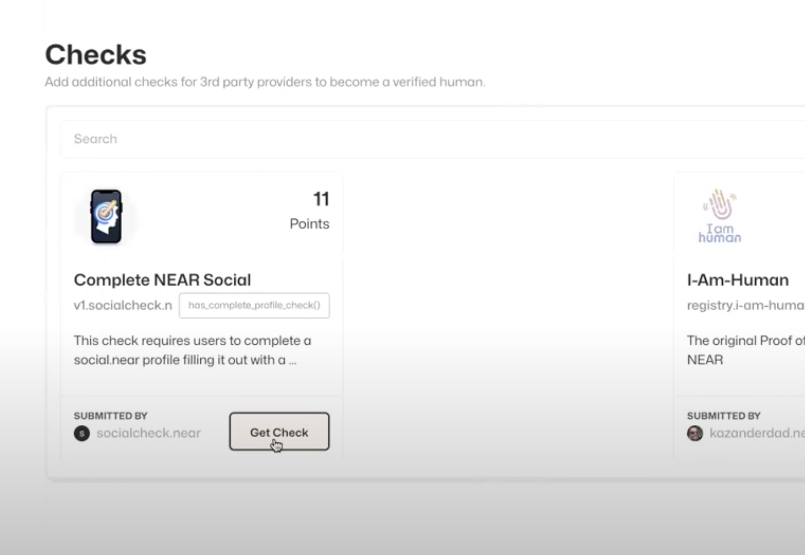
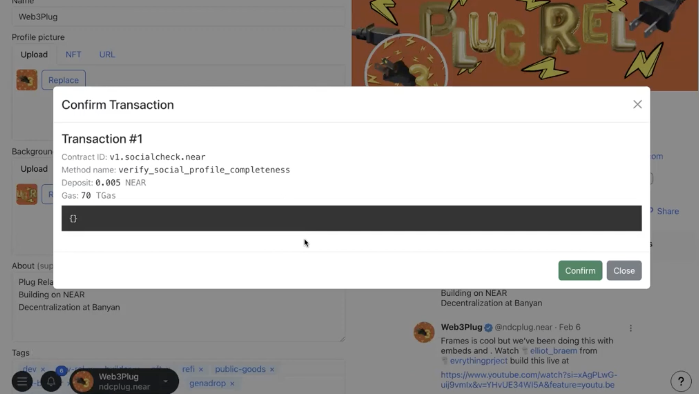
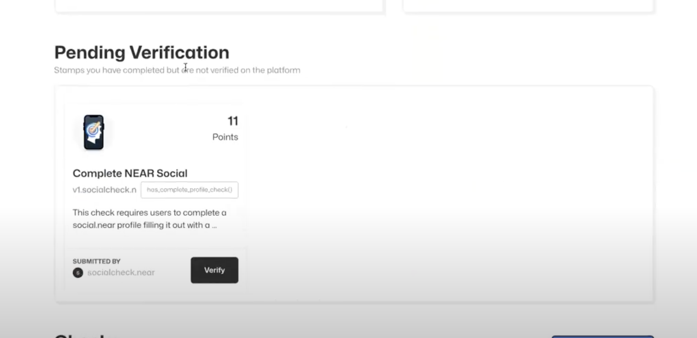
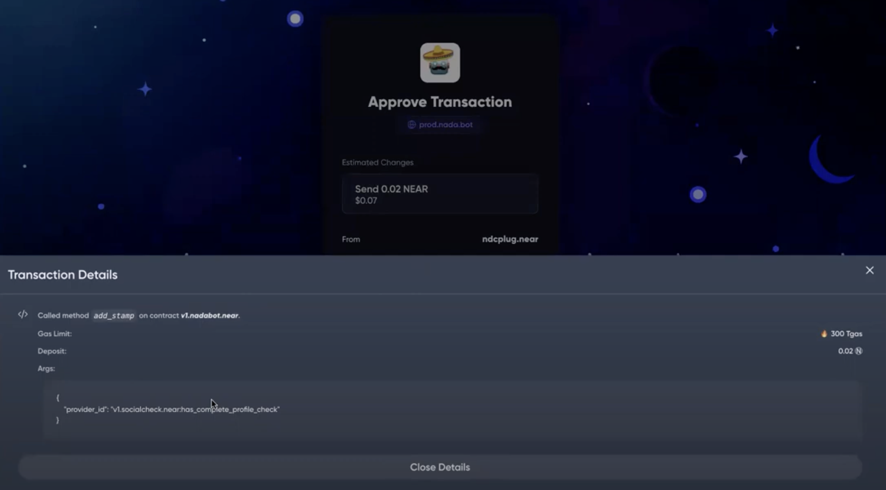
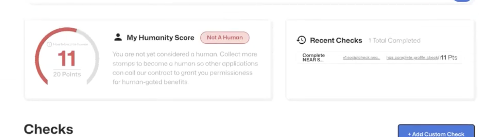

# 👨💼 For Users

Why Would Users Be Using Nada.bot

_**In order to prove you are not a bot you need to get different “Checks” which involves going to a 3rd party, verifying with their contract, than adding that check to our global registry.**_&#x20;


Different applications like PotLock and Cplanet Contensts do cross contract calls that enforce that you are not a bot.&#x20;


## What you can do

* Verify with different checks on 3rd party providers&#x20;
* Validate and get a higher score


if you don’t have a wallet than create a NEAR Wallet. If you don’t have one get one at [shard.dog/nadabot](http://shard.dog/nadabot)


First you login, where you **start at human score of zero** if you never used the app or added a stamp to our contract. Even if you verified on other applications nada.bot is integrated you must add those checks to the [v1.nadabot.near](../../extra/our-contract.md) contract to get points. You aim is to get past this human score through a collection of stamps/checks. Then you are to look at stamp. Most stamps should say “Get Check”. This means we have checked their contract and you are not verified.




_It is important to note that this account will be the one you use to build your reputation and it cant be transferred to another account, so don’t you lose this._&#x20;


Every stamp is a 2 part step

* the page checks if you have that check on that contract -> if you don't it says _**"Get Check"**_ as a tan button, where it takes you to an external link to verify with that sybil provider contract
* you come back to page, now if you successfully got the check on that contract, the stamp will say _**"Verify"**_ in black underneath Pending Verifications. You then need to add that stamp to the nadabot contract to move the stamp in the verified section and get the points associated with that stamp

Repeat to get more points until you are a human


But i did the i-am-human stamp? Why am i not a human? I am human is the name of the stamp, but not what it means to be a human on nada.bot. People often buy faces to fake this, and you still need to verify with our nadabot contract to even get the i-am-human stamp counted.


Click on a stamp, read the instructions, then click on the get check button. This should take you to a 3rd party link where you need to connect your wallet again and then verify. Note that each verification may require gas an in instruction to load up your account with enough gas to prove this stamp.

<figure><figcaption>
get a check to go to 3rd party app to verify on their contract
</figcaption></figure>

Every provider will be different and require you connect a 3rd party login, wallet, or even upload documents to update their contracts state. The following example is of the social check

<figure><figcaption>
Verifying with social check contract verifying that you compelted a social check
</figcaption></figure>

Once you verify through the sybil provider's application, go back to the [app.nada.bot](https://app.nada.bot) homepage and refresh. There that section should now be in the **Verify** section where we now detect that you have gotten that stamp but you need to pay 0.01 N in order to add the check to our nada.bot check registry to improve your human score. &#x20;

<figure><figcaption></figcaption></figure>

Once you confirm the transaction you should then see this check in the approve section and your score to go up.

<figure><figcaption>
Example of confirming stamp (add_stamp) on v1.nada.bot.near in order to get the points associated with the stamp - this is on meteor wallet extension
</figcaption></figure>

<figure><figcaption>
In this example at the time the Social Check was 11 points while the points needed to be a human was 20 points. This can change. As you can see 11/20 points is not enough to be a human. You can also see that you can see recent check
</figcaption></figure>

Now after the transaction you can see the account has 11/20 points because 11 is the number of the Complete NEAR Social Profile check has and 20 is the Human Threshold or the minum amount of points at the time to be a human. This is subject to change. You can also see recent checks so you can see stamps you added. If you scroll all the way to bottom you can also see verified checks


_human threshold is subject ot change or get lower depending on bot activity, as well as weights based on perceived level of difficulty, however your status of verification doesn’t change. Say a weight for a Twitter Check by Shard.dog changes from 1->2 this means, your score will go up._


## Other Tutorials


[find-other-users.md](find-other-users.md)


