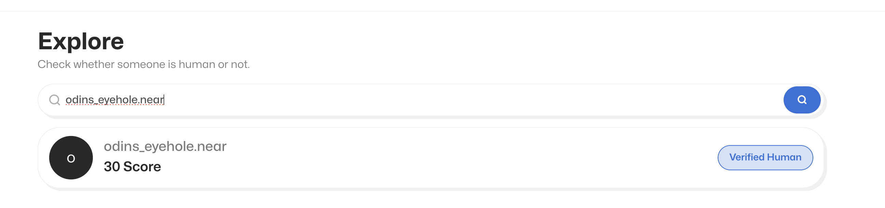
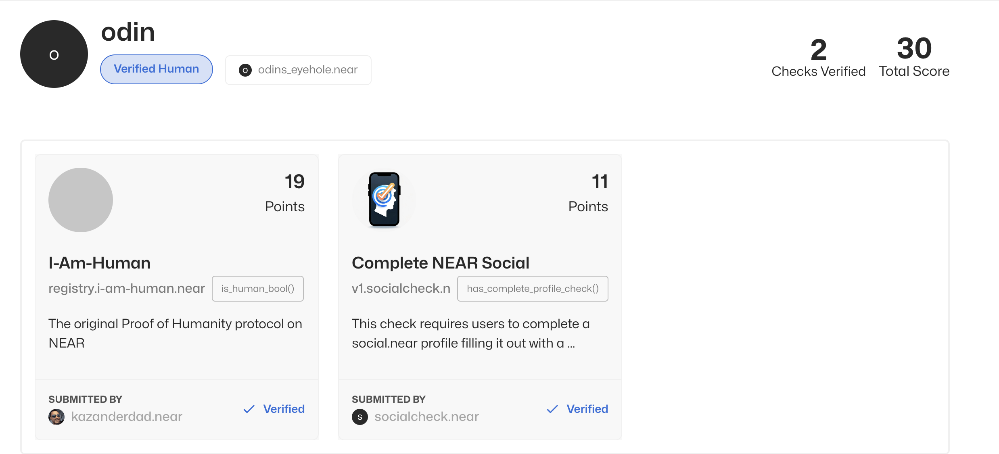

# 🔍 Find Other Users

Go to the Search Bar and type in the accountid

<figure><figcaption>
Its a search bar all you have to do is type
</figcaption></figure>

## Go to their Profile

If you click on their page you go to their profile and you can see which checks they have verified

<figure><figcaption>
search a persons profile
</figcaption></figure>

or go directly from the navbar by replace odins\_eyehole.near with {yournearaccountname}.id [https://app.nada.bot/account-info?accountId=odins\_eyehole.near](https://app.nada.bot/account-info?accountId=odins\_eyehole.near)
